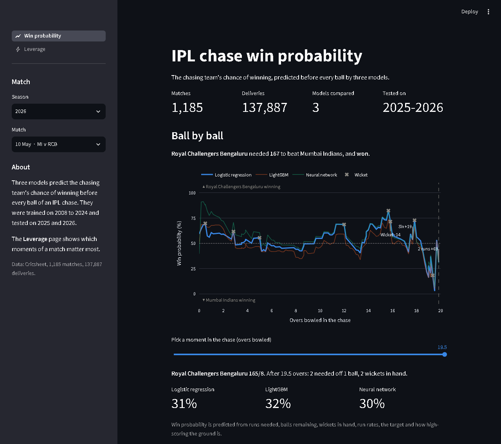
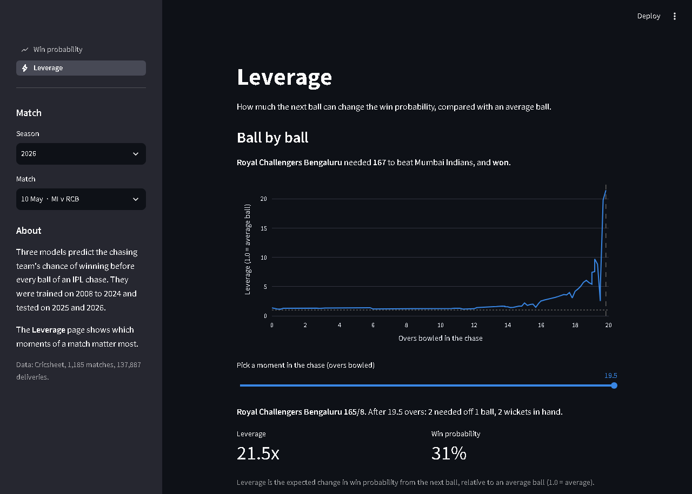
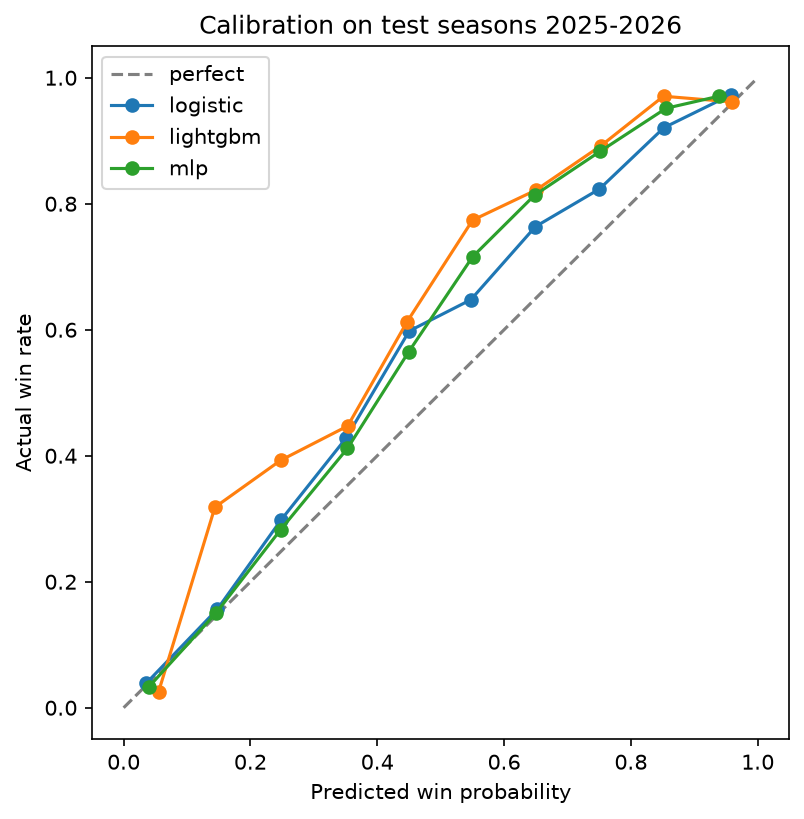

# IPL Chase Win Probability

Predicts the chasing team's chance of winning at every ball of an IPL run chase, compares three machine learning models on seasons they never saw, and uses the best one to measure which moments of a match carry the most tension.

**Try it:** https://ipl-win-probability-rxgwz3kbdl6nwuk3rmyjwe.streamlit.app/

**Built with:** Python, pandas, scikit-learn, LightGBM, Plotly, Streamlit



## Key findings

- **82% accuracy on unseen seasons.** The models pick the eventual winner on 82% of deliveries in 2025-2026, against 56% for always backing the chasing team.
- **The simplest model was as good as the most complex.** Logistic regression matched the neural network and beat LightGBM.
- **Tension is concentrated.** The top 10% of over-breaks hold 29% of all leverage, mostly late in close chases.
- **Known weakness:** all three models underrate the chasing team in the test seasons (see [Limitations](#limitations)).

## Why I built it

A broadcaster earns from attention, and attention during a cricket match is uneven. I wanted to answer two questions:

1. At any ball of a chase, how likely is the chasing team to win?
2. Which over-breaks come right before the tensest moments? Those are the most valuable ad slots.

## What it does

| Step | What happens |
|---|---|
| 1. Data | Every IPL match from 2008 to 2026 (from [Cricsheet](https://cricsheet.org/)) becomes one row per ball of the chase: 1,185 matches, 137,887 deliveries |
| 2. Models | Logistic regression, LightGBM and a neural network each predict win probability from the match situation |
| 3. Testing | All three are scored on the 2025 and 2026 seasons, which were held back from training |
| 4. Leverage | The model with the lowest log loss on the 2024 validation season (logistic regression) is used to score how much each ball could swing the match |
| 5. App | A Streamlit app replays any chase with the predictions and leverage |

## What the models see

Eight numbers, all known before the ball is bowled:

- runs needed, balls remaining, wickets in hand
- required run rate and current run rate
- the target
- the average first-innings score at the ground, and across the league recently

Team and player names are left out on purpose. Squads change every year, and the models should judge the situation, not the franchise.

## Results

Tested on 138 matches (15,914 deliveries) from 2025 and 2026.

| Model | Accuracy | Log loss | Brier score |
|---|---|---|---|
| No model (always back the chasing team) | 55.9% | 0.687 | 0.247 |
| Logistic regression | 81.9% | 0.382 | 0.123 |
| LightGBM | 80.9% | 0.429 | 0.138 |
| Neural network | 83.1% | 0.382 | 0.121 |

Accuracy is how often the model's favourite went on to win. Log loss and Brier score measure how far the predicted probabilities were from the results; lower is better.

**What I found**

- All three models are far better than guessing: about 82% against 56%.
- The simplest model, logistic regression, matches the neural network and beats LightGBM.
- Accuracy climbs through the chase, from about 75% in overs 1-6 to about 90% in overs 16-20, because less of the result is still open.

I expected LightGBM to win. My best explanation for why it didn't is that the game changed: average first-innings scores rose from about 165 before 2023 to about 190 in 2025-2026, so the test seasons contain targets the models rarely saw in training. A linear model extends its trend into that range, while tree models cannot predict beyond what they were trained on. I have not proved this is the cause.

## Leverage

Leverage measures how much the next ball can change the win probability.

For a given situation, I ask the model what the win probability would be after each possible next ball (dot, single, four, six, wicket and so on). Leverage is the average size of those changes, weighted by how often each outcome happens, divided by the same figure for an average ball. A leverage of 1.0 is an average ball; 3.0 means the ball matters three times as much.

An over-break is scored by the leverage of the first ball after it.

**What I found** across 2,572 over-breaks in the test seasons:

- The top 10% of over-breaks hold 29% of all leverage; the top 20% hold 44%.
- Average leverage is about 0.7 before overs 7-15 and 2.2 before the final over.

So match tension is concentrated in a small number of breaks, mostly late in close chases.



## Limitations

- **Leverage is a proxy for viewer attention.** I have no viewership data to check it against. With minute-by-minute viewer numbers, I would compare viewer drop-off in high- and low-leverage ad breaks, controlling for teams, time slot and match stage.
- **The models underrate the chasing team in the test seasons.** When logistic regression gave the chasing team about 45%, it won 60% of the time; when LightGBM gave about 55%, it won 77%. The likely cause is the same rise in scoring. Leverage is built on these probabilities, so it inherits the error. In the chart below, a perfect model would sit on the dashed line; all three sit above it.

  

- 138 test matches is a small sample, so small gaps between models are noise.
- Only the second innings is modelled. Rain-affected matches are excluded.
- I looked at test scores once before the final setup. After that I lowered the neural network's learning rate and added a refit on train plus validation data, both chosen using the 2024 season. The features did not change.

## How the models were trained

- **Split by season:** train on 2008-2023, tune on 2024, test on 2025-2026. A random split would put ball 50 of a match in training and ball 51 in testing, which leaks the result.
- **Logistic regression:** standardised features.
- **LightGBM:** 206 trees with 7 leaves each, constrained so that needing more runs can never raise the win probability.
- **Neural network:** two hidden layers of 64 and 32 units.

After tuning, each model is refit on the training and validation seasons together.

## Run it

```bash
pip install -r requirements.txt
streamlit run app.py
```

The processed data and trained models are in the repo, so the app runs as is. To rebuild everything, download `ipl_json.zip` from Cricsheet, unzip it into `data/raw/ipl_json/`, and run:

```bash
python src/build_dataset.py
python src/train.py
python src/evaluate.py
python src/leverage.py
```

## Files

```
app.py                 Entry point: sidebar, match picker, page navigation
views/                 The two pages: win probability and leverage
charts.py              Data loading and chart pieces both pages use
src/features.py        Feature definitions shared by every script
src/build_dataset.py   Cricsheet JSON to one row per delivery
src/train.py           Trains the three models
src/evaluate.py        Scores them on the test seasons
src/leverage.py        Win probability for any situation, and leverage
models/                Trained models and their settings
reports/               Metrics and a calibration chart
data/processed/        The dataset and the predictions the app reads
docs/                  Screenshots used in this README
```
